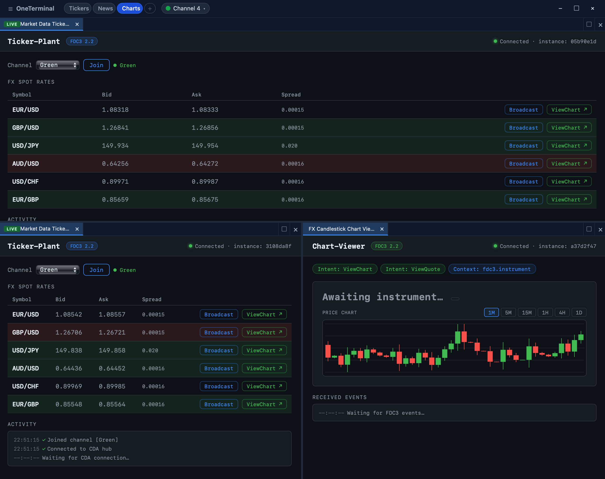

# OneTerminal

> An open-source desktop container for building **interoperable trading and capital-markets applications** — powered by [Tauri 2](https://tauri.app) and [FDC3 2.2](https://fdc3.finos.org).

OneTerminal lets you compose a workspace of independent browser apps — tickers, charts, blotters, news, OMS panels, dashboards — that share context through an FDC3 desktop agent and run inside lightweight native windows. Bring your own apps, your own engine (WebView2, WKWebView, Electron, or a custom plugin), and your own theme. We handle window management, channels, intents, dashboards, and engine lifecycle.



<p align="center">
  <a href="#-quick-start"><strong>Quick Start →</strong></a> &nbsp;·&nbsp;
  <a href="#-features"><strong>Features</strong></a> &nbsp;·&nbsp;
  <a href="#-architecture"><strong>Architecture</strong></a> &nbsp;·&nbsp;
  <a href="CONTRIBUTING.md"><strong>Contributing</strong></a> &nbsp;·&nbsp;
  <a href="docs/plans/README.md"><strong>Roadmap</strong></a>
</p>

---

## Why OneTerminal?

Buy-side and sell-side desks have spent the last decade stitching together browser apps inside heavyweight containers. OneTerminal is a lightweight, fully open-source alternative — built on modern Tauri 2, FINOS FDC3 2.2, and a Rust core — so you can:

- **Ship a branded trading workspace in days, not quarters** — scaffold a workspace with `create-one-terminal`, wire your apps to the App Directory, done.
- **Run your existing browser apps unchanged** — drop in any HTTP(S) URL; FDC3 channels and intents work via a small `fdc3-plugin.js` script.
- **Choose the right engine per app** — system WebView for native footprint, Electron for compatibility, or a custom engine via the plugin system.
- **Stay in control** — everything is open source, runs locally, has no telemetry, and is built on a tiny Rust + TypeScript codebase you can read in an afternoon.

---

## ✨ Features

### Workspace & UX

- **Tiled dashboards with tabs** — drag, split, stack, and rename tabs. Persist multiple dashboards per Terminal and switch between them with one click.
- **Multiple Terminal instances** — each with its own dashboard list, theme, and configuration.
- **App Menu drawer** — discover and launch widgets directly from the Terminal. The catalog **combines** the FDC3 App Directory with a local `widgets.config.json`; each entry is badged by source. Point the Terminal at any App Directory endpoint from the drawer's **App Directory** section (persisted per-user, applied live).
- **Customisable per-app UI** — register custom widget headers and tab context-menu items per `appId` ([see widget extension points](#widget-ui-extension-points)).
- **Hotkey-driven** — Command Palette ([Epic 06](docs/plans/06-command-palette-hotkeys.md)) is on the roadmap; keybindings configurable today.

### Interoperability (FDC3 2.2)

- **User channels, app channels, private channels** — full FDC3 2.2 channel semantics.
- **Intents and intent resolution** — `raiseIntent`, `addIntentListener`, intent picker UI included.
- **Context broadcasting** — typed contexts (`fdc3.instrument`, `fdc3.contact`, custom types) routed through the desktop agent.
- **FINOS DACP** — Desktop Agent Communication Protocol bridge for multi-instance interop.

### Engines

- **Four engine families, one app shape** — `wkwebview` (macOS), `webview2` (Windows), `electron`, and **custom** engines via plugin manifests.
- **Per-app engine pinning** — pick the engine and version in the App Directory record. The Desktop Agent downloads and caches runtimes on demand.
- **Webview pre-warm pool** — `OT_WEBVIEW_POOL_SIZE` keeps spawn latency low for first-tab opens.

### Platform & Extensibility

- **App Directory** — embedded FDC3 AppD REST API + React management UI with auth provider plugin support.
- **Framework plugin system** ([Epic 08](docs/plans/08-plugin-system.md)) — Node.js sidecars that extend the Desktop Agent, App Directory, and browser API surface (`window.OT.plugins`).
- **Engine plugin manifests** — register new engine families (CEF, Servo, …) via a `manifest.json` — no recompile.
- **Scaffolder** — `npx create-one-terminal` generates a new workspace; `upgrade` migrates it to newer framework versions in place.

### Developer experience

- **Rust workspace + npm workspace, side by side** — `cargo check --workspace`, `npm run build:all`.
- **Hot-reload dev loops** — App Directory and sample apps reload on save; Tauri apps rebuild incrementally.
- **Sample apps included** — `sample-ticker` (port 3010) and `sample-chart` (port 3011) show channel broadcast + intent handling.
- **Typed FDC3 client** — `@one-terminal/fdc3-client` ships full FDC3 2.2 TypeScript definitions.

---

## 🚀 Quick Start

### Prerequisites

| Tool                          | Version                               |
| ----------------------------- | ------------------------------------- |
| [Rust](https://rustup.rs)     | stable ≥ 1.77                         |
| [Node.js](https://nodejs.org) | ≥ 20 LTS                              |
| Xcode Command Line Tools      | macOS only — `xcode-select --install` |

### Option A — Scaffold a new workspace

The fastest way to evaluate OneTerminal for your team:

```sh
npx create-one-terminal my-terminal
```

The scaffolder asks for a **variant**:

- **Standalone** _(default)_ — Terminal + a single sample widget, joins an external FDC3 agent. No Desktop Agent or App Directory shipped. Best for evaluating the Terminal or joining an existing FDC3 estate.
- **Enterprise** — full stack (Terminal + Desktop Agent + App Directory + samples). Best for platform teams.

```sh
# Standalone start (two terminals):
cd my-terminal
npm install
npm run dev:sample-widget     # http://localhost:3012
npm run dev:terminal          # separate terminal

# Enterprise start (three terminals):
npm run dev:app-directory     # http://localhost:3005
npm run dev:desktop-agent     # separate terminal
npm run dev:terminal          # separate terminal
```

Add new widgets in either variant with `npm run create-widget -- --name <name>` (recommended — runs a workspace-local, dependency-free Node script at `scripts/new-widget.mjs`) or `npx create-one-terminal new-widget <name>` (uses the published scaffolder). On Standalone the widget is registered in `widgets.config.json`; on Enterprise the wizard prints a curl command for the App Directory (or runs it if `OT_APPD_TOKEN` is set).

Enterprise workspaces also ship `apps/app-directory/src/data.ts` for persisting AppD records.

### Option B — Hack on the framework

Clone this repo and run the same dev loop:

```sh
git clone https://github.com/OneTerminal/one-terminal.git
cd one-terminal
npm install

npm run dev:app-directory      # http://localhost:3005
npm run dev:sample-ticker      # http://localhost:3010   (optional)
npm run dev:sample-chart       # http://localhost:3011   (optional)
npm run dev:desktop-agent      # separate terminal
npm run dev:terminal           # separate terminal
```

> The first `cargo` build takes 1–2 minutes. Subsequent incremental builds are seconds.

### Build for production

```sh
npm run build:terminal         # OneTerminal window manager
npm run build:desktop-agent    # Desktop Agent
npm run build:all              # All Tauri apps in sequence
```

### Your first FDC3 app — 10 lines

Drop this into any HTML page served from a URL you register in the App Directory:

```html
<script type="module">
  import { DesktopAgentClient } from "/fdc3-plugin.js";
  const fdc3 = await DesktopAgentClient.connect("my-app-id");
  await fdc3.joinUserChannel("Green");
  await fdc3.addContextListener("fdc3.instrument", (ctx) => {
    document.title = `Watching ${ctx.id.ticker}`;
  });
</script>
```

Open it inside OneTerminal alongside the sample ticker — switch both to the Green channel — and watch context flow.

---

## 🧱 Architecture

```
┌─────────────────────────────────────────────────────┐
│  OneTerminal  (apps/one-terminal)                   │
│  Window manager — hosts app webviews in tabs        │
│  Reads App Directory to discover available apps     │
└────────────────┬────────────────────────────────────┘
                 │ TCP 7890
┌────────────────▼────────────────────────────────────┐
│  Desktop Agent  (apps/desktop-agent)                │
│  FDC3 2.2 broker — channels, intents, DACP          │
│  Manages engine runtime downloads + launches        │
│  ┌─────────────────────────────────────────────┐    │
│  │  Engine Cache  <app_data>/engines/          │    │
│  │    wkwebview/<ver>/   webview2/<ver>/       │    │
│  │    electron/<ver>/    <plugin-family>/      │    │
│  └─────────────────────────────────────────────┘    │
└────────────────┬──────────────────┬─────────────────┘
                 │ WS 7891          │ UDP/WS 4475
        ┌────────▼──────┐  ┌────────▼──────┐
        │  fdc3-plugin  │  │  DACP bridge  │
        │  (browser JS) │  │  (multi-inst) │
        └───────────────┘  └───────────────┘
```

### Packages

| Path                      | Purpose                                                                                                  |
| ------------------------- | -------------------------------------------------------------------------------------------------------- |
| `apps/one-terminal`       | Window manager (Tauri 2 app)                                                                             |
| `apps/desktop-agent`      | FDC3 desktop agent + engine launcher                                                                     |
| `apps/tauri-webview-host` | Thin Tauri shell spawned for pinned WebView2/WKWebView apps                                              |
| `apps/electron-host`      | Thin Electron shell spawned for Electron-engine apps                                                     |
| `apps/app-directory`      | Express server serving FDC3 AppD REST API + management UI                                                |
| `packages/ot-core`        | Tauri-agnostic shared Rust crate (engine abstraction, plugin manifests)                                  |
| `packages/ot-fdc3`        | Tauri plugin: FDC3 2.2 TCP spoke client                                                                  |
| `packages/fdc3-plugin`    | Browser-side FDC3 2.2 client (`DesktopAgentClient`) — ships in both variants                             |
| `packages/fdc3-client`    | TypeScript FDC3 type definitions — Enterprise only (Tauri-bound, calls `fdc3_*` commands from `ot-fdc3`) |

### Sample apps

| Path                 | Port | Variant    | Description                                                                      |
| -------------------- | ---- | ---------- | -------------------------------------------------------------------------------- |
| `apps/sample-widget` | 3012 | standalone | Minimal FDC3 widget — connect, broadcast, receive context                        |
| `apps/sample-ticker` | 3010 | enterprise | Market data ticker — broadcasts `fx.rate` on the Green channel                   |
| `apps/sample-chart`  | 3011 | enterprise | Candlestick chart — mock EUR/USD stream, handles `ViewChart`/`ViewQuote` intents |

---

## ⚙️ Configuration

The Desktop Agent reads `agent.config.json` (bundled as a resource) and applies environment variable overrides on top.

<details>
<summary><strong>agent.config.json (default)</strong></summary>

```json
{
  "title": "OneTerminal Desktop Agent",
  "appDirectoryUrl": "http://localhost:3005/v2/apps",
  "engineCatalogUrl": "http://localhost:3005/v2/engines",
  "ports": {
    "tcpBroker": 7890,
    "fdc3Bus": 7891,
    "dacpBridge": 4475
  },
  "userChannels": [
    { "id": "Red", "displayName": "Red", "color": "#E74C3C" },
    { "id": "Orange", "displayName": "Orange", "color": "#E67E22" },
    { "id": "Yellow", "displayName": "Yellow", "color": "#F1C40F" },
    { "id": "Green", "displayName": "Green", "color": "#2ECC71" },
    { "id": "Teal", "displayName": "Teal", "color": "#1ABC9C" },
    { "id": "Blue", "displayName": "Blue", "color": "#3498DB" },
    { "id": "Purple", "displayName": "Purple", "color": "#9B59B6" },
    { "id": "Pink", "displayName": "Pink", "color": "#EC407A" }
  ]
}
```

</details>

### Environment variable overrides

**Desktop Agent (Enterprise only):**

| Variable           | Overrides          |
| ------------------ | ------------------ |
| `OT_TITLE`         | Window title       |
| `OT_APP_DIR_URL`   | `appDirectoryUrl`  |
| `OT_CATALOG_URL`   | `engineCatalogUrl` |
| `OT_TCP_PORT`      | `ports.tcpBroker`  |
| `OT_FDC3_BUS_PORT` | `ports.fdc3Bus`    |
| `OT_DACP_PORT`     | `ports.dacpBridge` |

**Terminal (both variants):**

| Variable                 | Overrides                                                                                                                                                             |
| ------------------------ | --------------------------------------------------------------------------------------------------------------------------------------------------------------------- |
| `OT_APP_DIR_URL`         | `appDirectoryUrl` — App Directory endpoint (blank disables the App Directory source; can also be overridden per-user from the App Menu → App Directory section)       |
| `OT_WIDGETS_CONFIG_PATH` | `localWidgetsPath` — path to `widgets.config.json` (default `widgets.config.json`, resolved from the bundle resource dir, a `resources/` dir, or upward from the cwd) |
| `OT_FDC3_AGENT_URL`      | `fdc3.agentUrl` — external FDC3 agent WebSocket URL (Standalone)                                                                                                      |
| `OT_WEBVIEW_POOL_SIZE`   | Pre-warmed webview pool size (default 1)                                                                                                                              |

> The Terminal's widget catalog is the **union** of the App Directory (`appDirectoryUrl`) and the local `widgets.config.json` — not an either/or switch. An empty `appDirectoryUrl` disables the remote source; a missing `widgets.config.json` disables the local source. The legacy `OT_WIDGET_SOURCE` / `widgetSource` field is deprecated and no longer selects between sources (retained only for back-compat deserialization).

For the full list (App Directory auth, native-app allowlists, engine cache root), see [CLAUDE.md → Environment variables](CLAUDE.md#environment-variables-expanded).

---

## 🖥️ Browser Engine Support

OneTerminal supports four engine families:

| Family      | Description                                             |
| ----------- | ------------------------------------------------------- |
| `wkwebview` | macOS system WebKit — always available, no download     |
| `webview2`  | Windows system WebView2 — always available, no download |
| `electron`  | Electron — requires `apps/electron-host` to be set up   |
| _custom_    | Any engine via a plugin manifest (see below)            |

### Selecting an engine per app

In the App Directory record, set `hostManifests.oneTerminal.engine`:

```json
{
  "appId": "my-app",
  "hostManifests": {
    "oneTerminal": {
      "engine": { "family": "electron", "version": "29.3.0" }
    }
  }
}
```

Omit `engine` (or set `"version": "system"`) to use the OS-default WebView.

### Setting up Electron

```sh
npm run setup:electron-host            # install electron binary once
npm run dev:terminal:electron          # OneTerminal with Electron support
npm run dev:desktop-agent:electron     # Desktop Agent with Electron support
```

### Engine plugin manifests

Drop a `manifest.json` into `<engine-cache>/plugins/<family>/` to register a new engine family without recompiling:

```json
{
  "family": "cef",
  "label": "Chromium Embedded Framework",
  "supportedPlatforms": ["windows", "macos", "linux"],
  "launchMode": {
    "type": "spawnBinary",
    "binaryName": "cef-host",
    "envTemplates": [
      { "key": "CEF_URL", "value": "{{url}}" },
      { "key": "CEF_TITLE", "value": "{{title}}" },
      { "key": "CEF_APP_ID", "value": "{{app_id}}" },
      { "key": "CEF_RUNTIME_PATH", "value": "{{runtime_path}}" }
    ]
  }
}
```

**`launchMode.type` values:**

| Type                | Behaviour                                                   |
| ------------------- | ----------------------------------------------------------- |
| `inProcess`         | Render inside the Desktop Agent Tauri webview               |
| `spawnTauriHost`    | Spawn `tauri-webview-host` binary                           |
| `spawnElectronHost` | Spawn `apps/electron-host` via Electron                     |
| `spawnBinary`       | Spawn an arbitrary binary with env vars from `envTemplates` |

**Template variables** in `envTemplates.value`:

| Variable           | Resolved value                                 |
| ------------------ | ---------------------------------------------- |
| `{{url}}`          | App URL from App Directory                     |
| `{{title}}`        | App display name                               |
| `{{app_id}}`       | FDC3 `appId`                                   |
| `{{runtime_path}}` | Absolute path to the downloaded engine runtime |

A sample CEF manifest ships at `apps/desktop-agent/src-tauri/resources/plugins/cef/manifest.json`.

---

## 📒 Managing the App Directory

The App Directory (`apps/app-directory`) serves the FDC3 AppD REST API and ships a management UI. Three ways to add, edit, or remove apps:

### Option 1 — Management UI (recommended for quick changes)

```sh
npm run dev:app-directory    # http://localhost:3005
```

- **Add** — click **Register Application** and fill in the form.
- **Edit** — click the pencil icon on any listed app.
- **Delete** — click the trash icon.

> **Note:** The server stores apps in memory. Changes made through the UI (or the REST API) are lost when the server restarts. To persist them, copy the updated records into `apps/app-directory/src/data.ts` (Option 2).

### Option 2 — Edit `data.ts` (persistent)

Edit `apps/app-directory/src/data.ts` and add or update entries in the `_apps` array. Required fields are `appId`, `name`, `type`, and `details.url`:

```typescript
{
  appId:   "my-app",
  name:    "My App",
  type:    "web",
  details: { url: "http://localhost:4000" },
  title:   "My App",
  version: "1.0.0",
}
```

After editing, rebuild the static dist so the changes are bundled into the production binary:

```sh
npm run build:app-directory
```

During development (`npm run dev:app-directory`) the server hot-reloads and serves directly from source — no rebuild needed.

### Option 3 — REST API

The server exposes a standard FDC3 AppD CRUD API while it is running:

| Method   | Path              | Action                               |
| -------- | ----------------- | ------------------------------------ |
| `GET`    | `/v2/apps`        | List all apps (supports `?$filter=`) |
| `GET`    | `/v2/apps/:appId` | Get one app                          |
| `POST`   | `/v2/apps`        | Register a new app                   |
| `PUT`    | `/v2/apps/:appId` | Replace an existing app              |
| `DELETE` | `/v2/apps/:appId` | Remove an app                        |

```sh
curl -X POST http://localhost:3005/v2/apps \
  -H "Content-Type: application/json" \
  -d '{"appId":"my-app","name":"My App","type":"web","details":{"url":"http://localhost:4000"}}'
```

Same in-memory caveat applies — persist changes to `data.ts` to survive a restart.

---

## 🔌 FDC3 Integration (Browser Apps)

Browser apps use `fdc3-plugin.js` as the FDC3 desktop agent proxy over WebSocket.

```html
<script type="module">
  import { DesktopAgentClient } from "/fdc3-plugin.js";

  const fdc3 = await DesktopAgentClient.connect("my-app-id");

  // Join a user channel
  await fdc3.joinUserChannel("Green");

  // Broadcast context
  await fdc3.broadcast({
    type: "fdc3.instrument",
    id: { ticker: "EUR/USD" },
    name: "EUR/USD",
  });

  // Listen for context
  await fdc3.addContextListener("fdc3.instrument", (ctx) => {
    /* ... */
  });

  // Raise an intent
  await fdc3.raiseIntent("ViewChart", context);

  // Handle an intent
  await fdc3.addIntentListener("ViewChart", (ctx, meta) => {
    /* ... */
  });
</script>
```

The plugin resolves its agent URL in this order (first non-empty wins):

1. `<meta name="ot-fdc3-bus-url">` in the host page
2. `window.OT_FDC3_AGENT_URL` — injected by the Terminal at panel-load time when `fdc3.agentUrl` is configured (Standalone scaffolds)
3. `window.OT_FDC3_BUS_URL` — legacy override
4. `ws://localhost:7891/fdc3` — Enterprise-bundled Desktop Agent default

If the Terminal explicitly sets `window.OT_FDC3_AGENT_URL = ""` (no agent configured), `DesktopAgentClient.connect()` rejects with `NoAgentConfigured` instead of silently timing out — so Standalone widgets can surface a clear "no agent" state.

Override at the page level via:

```html
<meta name="ot-fdc3-bus-url" content="ws://myhost:7891/fdc3" />
```

```js
window.OT_FDC3_BUS_URL = "ws://myhost:7891/fdc3";
```

---

## 🧩 Widget UI Extension Points

Two static registries in `apps/one-terminal/src/components/` let developers customise per-app UI without touching the shell layout.

- **Custom widget headers** — `panelHeaders.tsx` — render badges, status indicators, or controls inside each tab's title bar, keyed by `appId`.
- **Tab context-menu items** — `contextMenuItems.ts` — add per-app actions to the right-click menu (`"*"` targets all apps).

Full API docs in [CLAUDE.md → Widget UI extension points](CLAUDE.md#widget-ui-extension-points). These will be superseded by `window.OT.plugins.get("contextMenu")` once the dynamic plugin system ([Epic 08](docs/plans/08-plugin-system.md)) lands — static entries will continue to work unchanged.

---

## 🛣️ Roadmap

Detailed implementation plans for the next development phase are in [`docs/plans/`](docs/plans/).

| Plan                        | File                                                                                                 | Milestone |
| --------------------------- | ---------------------------------------------------------------------------------------------------- | --------- |
| 01 — Widget Headers         | [docs/plans/01-customisable-widget-headers.md](docs/plans/01-customisable-widget-headers.md)         | Phase 1   |
| 02 — Faster Loading         | [docs/plans/02-faster-widget-loading.md](docs/plans/02-faster-widget-loading.md)                     | Phase 3   |
| 03 — App Directory Auth     | [docs/plans/03-app-directory-roles-permissions.md](docs/plans/03-app-directory-roles-permissions.md) | Phase 1   |
| 04 — Native App Launch      | [docs/plans/04-native-app-launch.md](docs/plans/04-native-app-launch.md)                             | Phase 3   |
| 05 — Ticker View Chart      | [docs/plans/05-ticker-view-chart-enhancement.md](docs/plans/05-ticker-view-chart-enhancement.md)     | Phase 2   |
| 06 — Command Palette        | [docs/plans/06-command-palette-hotkeys.md](docs/plans/06-command-palette-hotkeys.md)                 | Phase 2   |
| 07 — Deployment             | [docs/plans/07-deployment-and-hosting.md](docs/plans/07-deployment-and-hosting.md)                   | Phase 4   |
| 08 — Plugin System          | [docs/plans/08-plugin-system.md](docs/plans/08-plugin-system.md)                                     | Phase 5   |
| 09 — Dashboards & Terminals | [docs/dashboards/README.md](docs/dashboards/README.md)                                               | Phase 2–5 |
| 10 — Terminal App Menu      | [docs/plans/10-terminal-app-menu.md](docs/plans/10-terminal-app-menu.md)                             | Phase 2   |

See [docs/plans/README.md](docs/plans/README.md) for execution order and effort estimates.

---

## 🤝 Contributing

We welcome contributions of all sizes — bug reports, docs improvements, sample apps, engine plugins, framework plugins, and core changes.

- **First time?** Read [CONTRIBUTING.md](CONTRIBUTING.md) — it walks through the development setup, scaffolder workflow, and PR conventions.
- **Picking something up?** Browse [open issues](../../issues) or the [roadmap plans](docs/plans/) — many are scoped as discrete contributor-friendly tasks.
- **Building a sample trading app?** We'd love to feature it. Open a PR adding it under `apps/` or link it from the docs.
- **Reporting security issues?** Please email the maintainers privately rather than opening a public issue.

### Quick commands for contributors

```sh
cargo check --workspace                  # type-check Rust
cargo test --workspace                   # run Rust tests
cargo test -p desktop-agent engines::router

npm run build:app-directory              # rebuild AppD static dist
npm run build:samples                    # production builds of sample apps
npm run build:all                        # all Tauri apps

npm run create-migration                 # author a framework migration
npm run build:scaffolder                 # rebuild create-one-terminal
```

---

## 📦 Scaffolder

OneTerminal ships a `create-one-terminal` package that generates and upgrades workspaces:

```sh
npx create-one-terminal my-terminal             # scaffold a new workspace (Standalone or Enterprise)
npx create-one-terminal new-widget fx-rates     # scaffold a new widget app under apps/ (or `npm run create-widget -- --name fx-rates` inside the workspace)
npx create-one-terminal upgrade                 # upgrade an existing workspace in place
```

Templates live at `packages/create-one-terminal/templates/`, partitioned across three overlays:

- `templates/shared/` — Terminal shell, ot-core, fdc3-plugin
- `templates/enterprise/` — Desktop Agent, App Directory, ot-fdc3, fdc3-client, enterprise samples
- `templates/standalone/` — sample-widget, slim Cargo/package, `widgets.config.json`

Templates are regenerated from the live apps via `npm run create-migration`. See [SCAFFOLDING.md](SCAFFOLDING.md), [docs/plans/standalone-vs-enterprise-plans.md](docs/plans/standalone-vs-enterprise-plans.md), and [CONTRIBUTING.md](CONTRIBUTING.md) for the full workflow.

---

## 📁 Repository Structure

```
one-terminal/
├── apps/
│   ├── one-terminal/          Window manager (Tauri 2)
│   ├── desktop-agent/         FDC3 2.2 desktop agent + engine launcher (Tauri 2)
│   ├── app-directory/         FDC3 AppD REST API + management UI (Express + React)
│   ├── tauri-webview-host/    Minimal Tauri host for pinned WebView2/WKWebView apps
│   ├── electron-host/         Minimal Electron host for Electron-engine apps
│   ├── sample-ticker/         Sample: ticker plant browser app (port 3010)
│   └── sample-chart/          Sample: candlestick chart viewer browser app (port 3011)
├── packages/
│   ├── ot-core/               Shared Rust crate (engine abstraction, plugin manifests)
│   ├── ot-fdc3/               Tauri plugin: FDC3 2.2 TCP spoke client
│   ├── fdc3-plugin/           Browser FDC3 client (WebSocket transport)
│   ├── fdc3-client/           TypeScript FDC3 types + Fdc3Agent
│   └── create-one-terminal/   Scaffolder + upgrade tool
├── docs/
│   ├── dashboards/            Dashboards & multi-terminal planning docs
│   └── plans/                 Roadmap and implementation plans
├── Cargo.toml                 Rust workspace
└── package.json               npm workspace root
```

---

## 📄 License

OneTerminal is released under the [MIT License](LICENSE).

---

<p align="center">
  Built with ❤️ on <a href="https://tauri.app">Tauri 2</a> and <a href="https://fdc3.finos.org">FINOS FDC3 2.2</a>.
</p>
