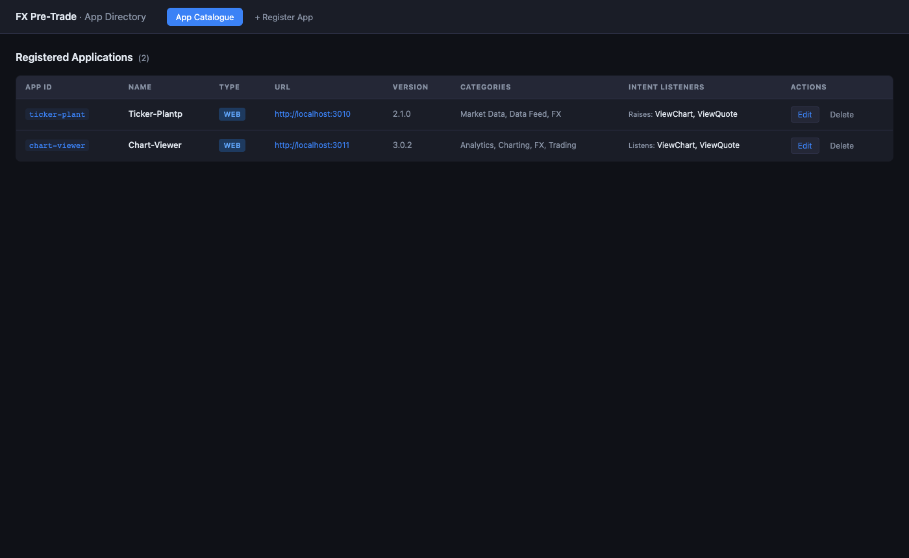
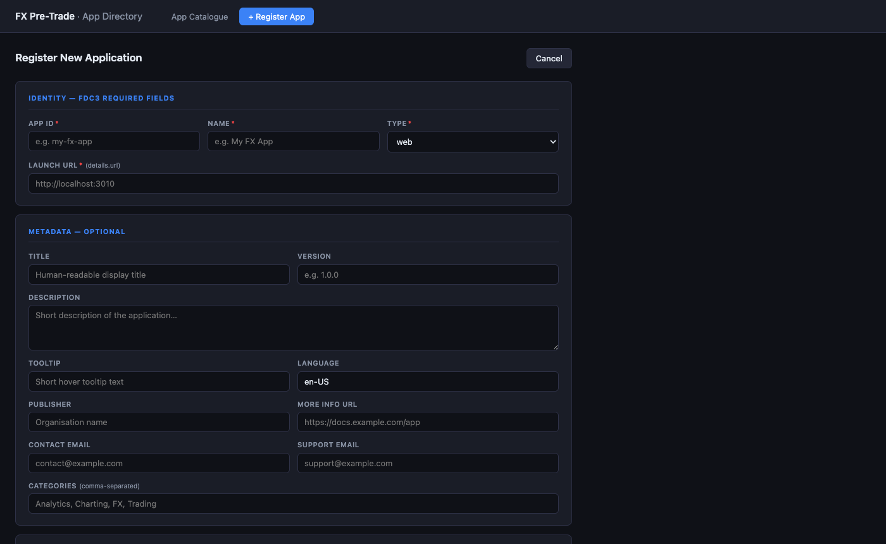
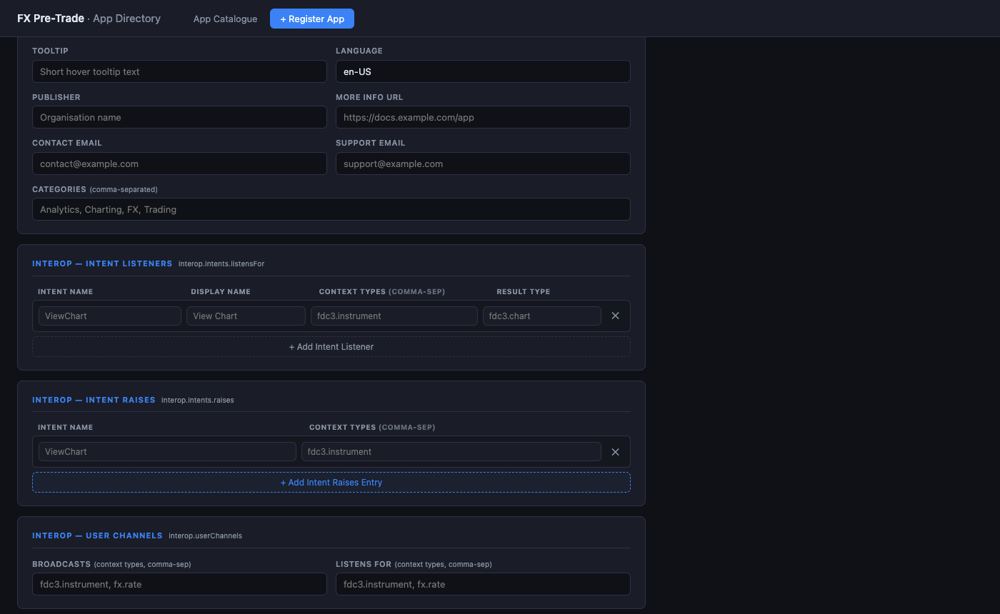
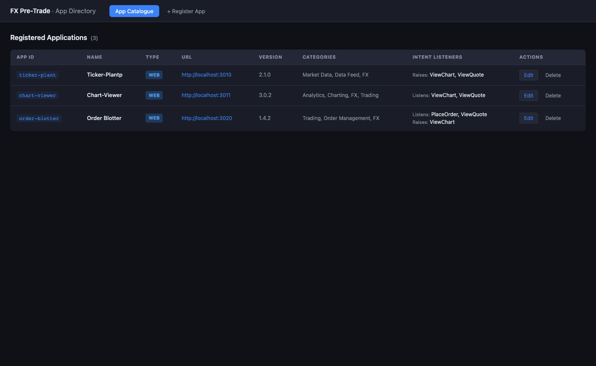
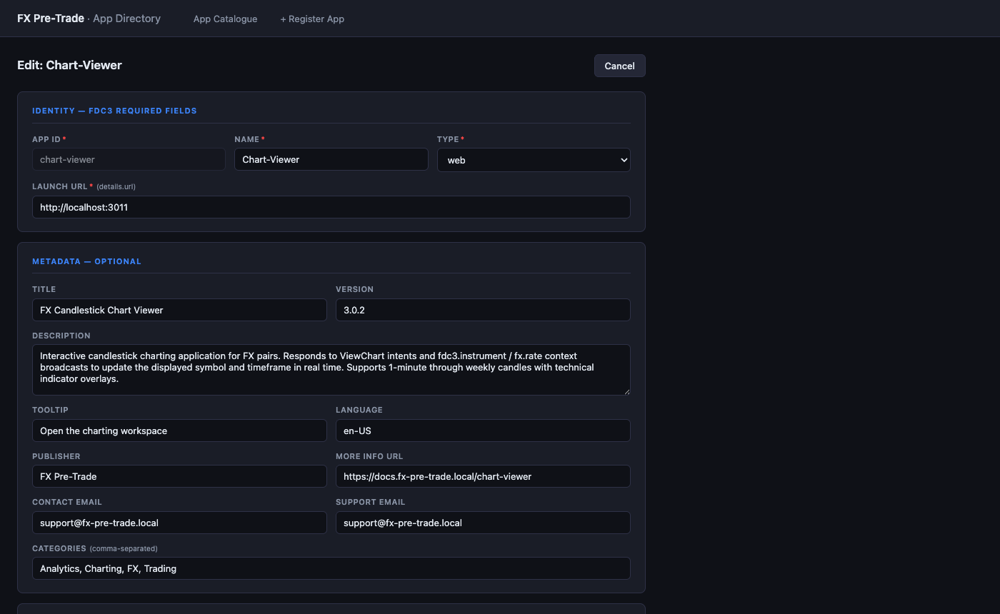

# FDC3 2.2 App Directory

A standalone **FDC3 2.2-compliant App Directory** service with a full-featured management UI. It serves as the application registry for the OneTerminal framework, supplying app records to the Desktop Agent launcher and IntentResolver.

---

## Overview

The App Directory runs on **`http://localhost:3005`** and provides two layers:

| Layer             | Technology             | Purpose                                                             |
| ----------------- | ---------------------- | ------------------------------------------------------------------- |
| **REST API**      | Express 4 + TypeScript | FDC3 2.2 `GET /v2/apps` endpoints + `POST`/`PUT`/`DELETE` mutations |
| **Management UI** | React 18 + Vite 5      | Browser-based form UI for registering and editing FDC3 app records  |

The CDA fetches from this service on startup (`AppDirectoryCache`) to populate its Launcher and intent resolution pipeline.

---

## Screenshots

### App Catalogue

All registered applications in a single table. Columns show App ID, Name, deployment type, launch URL, version, categories, and the app's declared FDC3 intent capabilities.



---

### Registering a New Application

The **Register App** form is organised into four collapsible sections. The top section captures the three fields the FDC3 spec mandates — `appId`, `name`, `type`, and `details.url`.



---

### Declaring Interoperability (FDC3 Intents & User Channels)

The lower sections of the form capture the full FDC3 interop graph: intent listeners (`interop.intents.listensFor`), intent raises (`interop.intents.raises`), and user-channel pub/sub (`interop.userChannels`). Each intent listener row captures the intent name, display name, accepted context types, and optional result type.



---

### Catalogue After Registration

After registering a third app via the form (or the REST API), the catalogue updates immediately. Intents declared in `listensFor` and `raises` are shown in the Intent Listeners column.



---

### Editing an Existing Application

Clicking **Edit** on any row opens the same form pre-populated with that app's full AppD record. The `appId` field is locked (since it is the primary key) — all other fields are editable. Changes are submitted via `PUT /v2/apps/:appId`.



---

## Getting Started

### Prerequisites

- Node.js ≥ 20 LTS
- npm ≥ 10

### Install and run (development)

```sh
# From the workspace root — installs all packages including this one
npm install

# Start just the App Directory API (hot-reload via tsx watch)
npm run dev:app-directory

# Or start API + Vite dev server concurrently (UI live-reloads at :5174)
cd apps/app-directory
npm run dev
```

In `dev` mode the Vite dev server runs at **`http://localhost:5174`** and proxies all `/v2` and `/health` requests to the Express API on `:3005`.

### Build for production

```sh
cd apps/app-directory
npm run build         # compiles TypeScript API + bundles React UI
npm start             # serves API + pre-built UI from :3005
```

After `npm run build`, the Express server serves the compiled React app from `ui/dist/` and the management UI is available at **`http://localhost:3005`**.

---

## API Reference

All endpoints are mounted at `/v2` per the FDC3 App Directory specification.

### `GET /v2/apps`

Returns all registered applications.

**Query parameters**

| Parameter | Format                 | Example                               |
| --------- | ---------------------- | ------------------------------------- |
| `$filter` | OData-style expression | `name eq 'chart-viewer'`              |
| `$filter` | OData category         | `categories/any(c: c eq 'Analytics')` |
| `$filter` | Intent listener        | `intents/listensFor/ViewChart`        |

**Response** `200 OK`

```json
{
  "applications": [
    /* AppD[] */
  ],
  "message": "OK"
}
```

---

### `GET /v2/apps/:appId`

Returns a single application by `appId` (exact, case-sensitive).

**Response** `200 OK` — `AppD` object
**Response** `404 Not Found` — `{ "message": "AppNotFound" }`

---

### `POST /v2/apps`

Register a new application. The `appId` must be unique.

**Body** — `AppD` with required fields:

```json
{
  "appId": "order-blotter",
  "name": "Order Blotter",
  "type": "web",
  "details": { "url": "http://localhost:3020" },
  "version": "1.4.2",
  "categories": ["Trading", "Order Management", "FX"],
  "interop": {
    "intents": {
      "listensFor": {
        "PlaceOrder": { "displayName": "Place Order", "contexts": ["fx.order"] },
        "ViewQuote": { "displayName": "View Quote", "contexts": ["fdc3.instrument"] }
      },
      "raises": {
        "ViewChart": ["fdc3.instrument"]
      }
    },
    "userChannels": {
      "broadcasts": ["fx.order", "fdc3.instrument"],
      "listensFor": ["fx.rate"]
    }
  }
}
```

**Response** `201 Created` — registered `AppD`
**Response** `400 Bad Request` — missing required fields
**Response** `409 Conflict` — `appId` already exists

---

### `PUT /v2/apps/:appId`

Full-replacement update for an existing application.

**Body** — complete `AppD` record (same shape as POST)

**Response** `200 OK` — updated `AppD`
**Response** `400 Bad Request` — missing required fields
**Response** `404 Not Found` — `appId` not registered

---

### `DELETE /v2/apps/:appId`

Remove an application from the directory. The CDA will no longer include it in Launcher or intent resolution after next refresh.

**Response** `204 No Content`
**Response** `404 Not Found`

---

### `GET /v2/engines`

Returns the engine catalog — the list of available browser runtimes per OS. Used by the AppForm UI to populate the engine-binding picker, and by the WM / CDA to validate engine entries in app records and to drive the runtime download flow.

```json
{
  "engines": {
    "windows": [
      { "family": "webview2", "version": "system", "label": "WebView2 (System Evergreen)" },
      {
        "family": "webview2",
        "version": "124.0.2478.97",
        "label": "WebView2 124 (Fixed Runtime)",
        "download": { "url": "...", "sha256": "...", "sizeBytes": 180000000 }
      },
      {
        "family": "electron",
        "version": "29.3.0",
        "label": "Electron 29 (Chromium 122)",
        "download": { "url": "...", "sha256": "...", "sizeBytes": 220000000 }
      }
    ],
    "macos": [
      { "family": "wkwebview", "version": "system", "label": "WKWebView (System WebKit)" },
      {
        "family": "electron",
        "version": "29.3.0",
        "label": "Electron 29 (Chromium 122)",
        "download": { "url": "...", "sha256": "...", "sizeBytes": 220000000 }
      }
    ]
  }
}
```

The catalog is defined in [`src/engines.ts`](src/engines.ts). Update that file to add or remove engine versions. Any `engineBindings` entry on a registered app is validated against this catalog at `POST` / `PUT` time — an unknown `(family, version)` pair returns `400`.

---

### `GET /health`

```json
{ "status": "ok", "version": "2.2" }
```

---

## FDC3 2.2 AppD Field Reference

The form captures every field defined in the FDC3 2.2 App Directory specification. Fields marked **required** will trigger a validation error if omitted.

### Identity (required)

| Field      | JSON key      | Description                                                                                      |
| ---------- | ------------- | ------------------------------------------------------------------------------------------------ |
| App ID     | `appId`       | Unique stable identifier. Alphanumeric, hyphens, underscores only. Immutable after registration. |
| Name       | `name`        | Short display name shown in launchers.                                                           |
| Type       | `type`        | See **App Types** below.                                                                         |
| Launch URL | `details.url` | URL the platform navigates to when opening the app. Required for `web` and `onlineNative` types. |

### App Types

The `type` field controls how the CDA Launcher opens the application when the user clicks **Launch** (or an intent resolver selects it).

| Type           | CDA launch behaviour                                                    | Use case                                                                                                    |
| -------------- | ----------------------------------------------------------------------- | ----------------------------------------------------------------------------------------------------------- |
| `web`          | Opens `details.url` in the **system default browser**                   | Standard browser-based apps — runs outside the desktop agent container                                      |
| `onlineNative` | Opens `details.url` in a **Tauri WebView container** managed by the CDA | Browser apps that should feel native: no browser chrome, controlled window size, re-focuses if already open |
| `native`       | Opens `details.url` via the system opener (OS default handler)          | Native executables or deep links (`file://`, custom scheme)                                                 |
| `citrix`       | Opens `details.url` via the system opener                               | Citrix-hosted virtual applications                                                                          |
| `other`        | Opens `details.url` via the system opener                               | Catch-all for non-standard deployment types                                                                 |

> **`onlineNative` in practice**
>
> When the CDA launches an `onlineNative` app it creates a dedicated `tauri::WebviewWindow` at the app's `details.url`. The window is labelled `app-<appId>` so subsequent launch requests re-focus the existing window instead of opening a second instance. The initial size is 1280 × 800 px and the title is set from `title` (falling back to `name`). The same behaviour applies when a `fdc3:open` message arrives from the FDC3 Bus.

### Metadata (optional)

| Field         | JSON key       | Description                                                             |
| ------------- | -------------- | ----------------------------------------------------------------------- |
| Title         | `title`        | Longer human-readable title for detail views.                           |
| Description   | `description`  | Free-text description shown in app catalogues.                          |
| Version       | `version`      | Semver string, e.g. `2.1.0`.                                            |
| Tooltip       | `tooltip`      | Short text shown on icon hover in launcher UIs.                         |
| Language      | `lang`         | BCP-47 locale code, e.g. `en-US`.                                       |
| Publisher     | `publisher`    | Organisation that publishes or maintains the app.                       |
| Contact Email | `contactEmail` | General contact address.                                                |
| Support Email | `supportEmail` | Support / helpdesk address.                                             |
| More Info URL | `moreInfo`     | Link to documentation or marketing page.                                |
| Categories    | `categories`   | Comma-separated classification tags used for filtering in launcher UIs. |

### Interop — Intent Listeners (`interop.intents.listensFor`)

Declares which FDC3 intents this app can handle. Each row maps to one entry in the `listensFor` record.

| Column        | JSON key      | Description                                                                     |
| ------------- | ------------- | ------------------------------------------------------------------------------- |
| Intent Name   | key           | FDC3 standard intent name, e.g. `ViewChart`, `PlaceOrder`.                      |
| Display Name  | `displayName` | Human-readable label used in intent resolver dialogs.                           |
| Context Types | `contexts[]`  | Comma-separated FDC3 context types the handler accepts, e.g. `fdc3.instrument`. |
| Result Type   | `resultType`  | Optional. FDC3 type returned by the handler, e.g. `fdc3.chart`.                 |

### Interop — Intent Raises (`interop.intents.raises`)

Declares which intents this app may raise, and with which context types. Used by intent resolvers to enumerate capable producers.

| Column        | JSON key         | Description                                                         |
| ------------- | ---------------- | ------------------------------------------------------------------- |
| Intent Name   | key              | FDC3 intent this app raises, e.g. `ViewChart`.                      |
| Context Types | value (string[]) | Comma-separated context types that can accompany the raised intent. |

### Interop — User Channels (`interop.userChannels`)

| Field       | JSON key       | Description                                       |
| ----------- | -------------- | ------------------------------------------------- |
| Broadcasts  | `broadcasts[]` | Context types this app pushes onto user channels. |
| Listens For | `listensFor[]` | Context types this app reads from user channels.  |

### Engine Bindings (`engineBindings`)

Declares which browser engine(s) the app supports, per operating system. When present, the WM header and CDA launcher show an engine-picker dialog before launch so the user can choose which runtime to open the app with.

```json
{
  "engineBindings": {
    "windows": [
      { "family": "webview2", "version": "system" },
      { "family": "electron", "version": "29.3.0" }
    ],
    "macos": [
      { "family": "wkwebview", "version": "system" },
      { "family": "electron", "version": "29.3.0" }
    ]
  }
}
```

| Field   | JSON key                          | Description                                                                                                |
| ------- | --------------------------------- | ---------------------------------------------------------------------------------------------------------- |
| OS      | key (`windows`, `macos`, `linux`) | Operating system the binding list applies to                                                               |
| Family  | `family`                          | Engine family: `webview2`, `wkwebview`, or `electron`                                                      |
| Version | `version`                         | `"system"` for the OS-native runtime, or a specific version string matching an entry in the engine catalog |

- Each `(family, version)` pair is validated against the `/v2/engines` catalog at registration time. An unknown pair returns `400`.
- Omitting `engineBindings` (or omitting a particular OS key) means the app has no engine preference for that OS — the WM will open it in its own engine without showing a picker.
- The first entry in each OS list is treated as the default when the app is launched non-interactively (e.g. via `fdc3:open` or `cda_launch_app` without an explicit override).

---

## Architecture

```
http://localhost:3005
│
├── GET  /           → React SPA (ui/dist/index.html)
├── GET  /health     → { status: "ok", version: "2.2" }
│
└── /v2
    ├── GET    /engines         → engine catalog (families + versions + download metadata)
    ├── GET    /apps            → list (filterable via $filter)
    ├── GET    /apps/:appId     → single record
    ├── POST   /apps            → create  (201)
    ├── PUT    /apps/:appId     → update  (200)
    └── DELETE /apps/:appId     → remove  (204)

In-memory store (src/data.ts)
  getApps() / setApps()  ← mutable array seeded with ticker-plant + chart-viewer

React UI (ui/src/)
  App.tsx            ← tab routing, toast notifications, app-level fetch
  components/
    AppList.tsx      ← table view with type badges, intent columns, Edit/Delete
    AppForm.tsx      ← register + edit form; converts to/from AppD on submit
```

### Dev mode port layout

| Service         | Port | Notes                                      |
| --------------- | ---- | ------------------------------------------ |
| Express API     | 3005 | `npm run dev:api` — tsx watch              |
| Vite dev server | 5174 | `npm run dev:ui` — proxies `/v2` → `:3005` |
| Combined        | —    | `npm run dev` — both via `concurrently`    |

---

## Integration with the Central Desktop Agent

When the CDA starts it fetches `GET http://localhost:3005/v2/apps` into its `AppDirectoryCache`. Apps registered here appear in:

1. **Launcher tab** — app cards with a Launch button that opens `details.url` in the system browser
2. **Intent Resolver** (Tier 4) — when no running instance handles a raised intent, the CDA emits `cda:intent_needs_resolution`; the IntentResolverModal presents candidate apps from the directory filtered by the intent name

To refresh the CDA's view after registering new apps:

- Click **Refresh** in the CDA Launcher tab, or
- Call `cda_refresh_app_directory` via IPC, or
- Restart the CDA

---

## Scripts

| Script      | Command                        | Description                                     |
| ----------- | ------------------------------ | ----------------------------------------------- |
| `dev:api`   | `tsx watch src/index.ts`       | API with hot-reload                             |
| `dev:ui`    | `vite --config vite.config.ts` | UI dev server at :5174 with API proxy           |
| `dev`       | `concurrently ...`             | Both together                                   |
| `build:api` | `tsc`                          | Compile TypeScript to `dist/`                   |
| `build:ui`  | `vite build`                   | Bundle React app to `ui/dist/`                  |
| `build`     | `build:api && build:ui`        | Full production build                           |
| `start`     | `node dist/index.js`           | Run compiled server (serves UI from `ui/dist/`) |
| `typecheck` | `tsc --noEmit`                 | Type-check without emitting                     |
